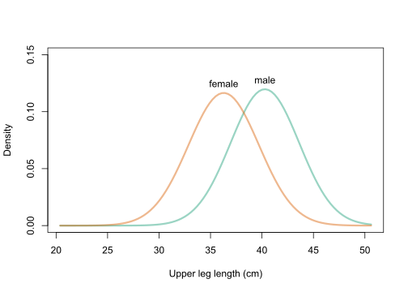

```{r global options, include = FALSE}
knitr::opts_chunk$set(echo=TRUE, warning=FALSE, message=FALSE)
require(magrittr)
require(dplyr)
library(tidyverse)
require(stats4)
```

# Instructions

The final exam will be a 30 minute one-on-one oral exam with the instructor recorded in Zoom. Please prepare solutions to the following is a set of questions. During the oral exam, the instructor will ask a series of questions covering topics from the course and the questions. For example, the instructor may ask:

1. Please explain how you solved a particular question.
1. Please solve a new question (perhaps closely related to a question below).
1. Please explain course topic X.

You will be graded on both the accuracy of your responses and the clarity with which you explain course concepts and solutions to questions.

The final exam should represent your own work.  Do not consult with or collaborate in any way with anyone other than the instructor.

Prior to meeting with the instructor, you should:

   + Create a folder in your Probability and Inference Portfolio; call it `99-final-exam`.
   + Compile, save, and push your solutions to your GitHub repository

# 1. Simulation

The Monte Hall problem is a classic game show.  Contestants on the show where shown three doors.  Behind one randomly selected door was a sportscar; behind the other doors were goats.

At the start of the game, contestants would select a door, say door A.  Then, the host would open either door B or C to reveal a goat.  At that point in the game, the host would ask the contestant if she would like to change her door selection.  Once a contestant decided to stay or change, the host would open the choosen door to reveal the game prize, either a goat or a car.

In this problem, consider a **modified** version of the Monte Hall problem in which the number of doors is **variable**.  Rather than 3 doors, consider a game with 4 or 5 or 50 doors.  In the modified version of the game, a contestant would select an initial door, say door A.  Then, the host would open **one** of the remaining doors to reveal a goat.  At that point in the game, the host would ask the contestant if she would like to change her door selection.  Once a contestant decided to stay or change, the host would open the choosen door to reveal the game prize, either a goat or a car.

Consider two strategies:
  
  1. Always stay with the first door selected.
  2. Always switch to the unopened door.

**C.** The function `game` below plays a single game of Monte Hall.  The function returns a vector of length two, the first element is the prize under strategy 1 and the second element is the prize under strategy 2.  The function has a single input parameter, N, which is the number of doors in the game.

Use the `game` function to estimate the probability that both strategies result in a goat. Let **N=4**.
```{r}
game <- function(N){
  if(N<3) stop("Must have at least 3 doors")
  prize <- sample(c(rep("goat",N-1),"car"), N)
  guess <- sample(1:N,1)
  game <- data.frame(door = 1:N, prize = prize, stringsAsFactors = FALSE) %>% 
    mutate(first_guess = case_when(
      door == guess ~ 1
      , TRUE ~ 0
    )) %>% 
    mutate(potential_reveal = case_when(
        first_guess == 1 ~ 0
      , prize == "car" ~ 0
      , TRUE ~ 1
    )) %>% 
    mutate(reveal = 1*(rank(potential_reveal, ties.method = "random") == 3)) %>% 
    mutate(potential_switch = case_when(
      first_guess == 1 ~ 0
      , reveal == 1 ~ 0
      , TRUE ~ 1
    )) %>% 
    mutate(switch = 1*(rank(potential_switch, ties.method = "random") == 3))
  c(game$prize[game$first_guess == 1], game$prize[game$switch == 1])
}
```

```{r}
R <- 1000 # number of replicates
strategy1 = rep(NA, R) # strategy 1 results
strategy2 = rep(NA, R) # strategy 2 results
goat1 = rep(NA, R) # strategy 1 goat
goat2 = rep(NA, R) # strategy 2 goat
set.seed(120320)
for (i in seq_along(strategy1)) {
  strategy1[i] = game(4)[1] # assign strategy 1 result
  strategy2[i] = game(4)[2] # assign strategy 2 result
  goat1[i] <- ifelse(strategy1[i]=="goat", 1,0) # determine if strategy 1 was a goat
  goat2[i] <- ifelse(strategy2[i]=="goat", 1,0) # determine if strategy 2 was a goat
}

mean(goat1) # calculate probability of strategy 1 results in goat
mean(goat2) # calculate probability of strategy 2 results in goat
```
The probability of Strategy 1 ending in goat is 76.8% and the probability of Strategy 2 ending in goat is 61.9%. 


**B**. Continuing from part **C**, what is the probability that at least one of the strategies results in winning a car?

```{r}
car = rep(NA, R) # either strategy 1 or 2 car
strategy1b = rep(NA, R) # strategy 1 results
strategy2b = rep(NA, R) # strategy 2 results
set.seed(120320)
for (i in seq_along(car)) {
  strategy1b[i] = game(4)[1] # assign strategy 1 result
  strategy2b[i] = game(4)[2] # assign strategy 2 result
  car[i] <- ifelse((strategy1b[i]=="car" | strategy2b[i]=="car"), # determine if strategy 1 or 2 was a car
                      1,0) 
}

mean(car) # probability of 1 or 2 resulting in car
```
The probability that at least one of the strategies results in winning a car is 52.8%

**A**. Communicate the precision of your simulated probability in part **B** by calculating a **99\%** confidence interval.
```{r}
prop.test(x = sum(car),n = R, conf.level = 0.99) # proportions
```
The 99% confidence interval for the simulated probabilities ranges from 48.68% to 56.88%.

# 2. Probability

Consider a test for a rare genetic condition.  Let T+ denote a test result that indicates the condition is present, while T- denotes absence.  Let D+ and D- denote the true status of the disease.

**C**.  Fill-in the probability table using the following information:

+ P(T+|D+) = .85,  and 
+ P(T-|D-) = .95,  and 
+ P(D+) = 0.001

|     |    D+    |    D-    |         |
|:---:|:--------:|:--------:|:-------:|
| T+  | 0.00085  | 0.04995  | 0.0508  |
| T-  | 0.00015  | 0.94905  | 0.9492  |
|     | 0.001    | 0.999    | 1       |

**B**. Calculate the **negative** predictive value of the test, P(D-|T-).

The negative predictive value of the test, P(D-|T-) = $$\frac{0.94905}{0.9492}$$ = 0.99984.

**A** Create a plot that shows how the **positive** predictive value as a function of the prevalence of disease, P(D+).

```{r, eval = FALSE}
prevalence <- seq(0.001, 0.1, length = 50)
ppv <- (0.85*prevalence) / (0.8*prevalence + 0.05)
plot(prevalence, ppv, xlab = "Prevalence", ylab = "PPV", type = "l")
```

# 3. Discrete Distributions

Suppose the yearly hospital charges (in thousands of dollars) for a randomly selected Vanderbilt student is a mixture distribution.

For 50% of students, the hospital charges will be $0.  For the remaining 50% of students, the hospital charges are a random variable described by a gamma distribution with shape = 2 and scale = 2.  (Again, in thousands of dollars.)   

```{r}
hospital_charges <- function(N){
  group <- rbinom(N, 1, 0.5)
  charges <- 0*group + rgamma(N, shape = 2, scale = 2)*(1-group)
  charges
}
```

**C**.  What is the 90th percentile for yearly hospital charges for a randomly selected Vanderbilt student?

```{r}
set.seed(120420)
N <- 1000 # samples
quantile(hospital_charges(N)*1000, 0.9)
hist(hospital_charges(N)*1000)
abline(v = quantile(hospital_charges(N)*1000, .9), col = "red")
```
I used the quantile function to find the 90th percentile of yearly hospital charges which is $6,369.85. I compared it to a histogram for a visual to make sure the answer is in the ballpark range.

**B**.  Consider the **class** average yearly hospital charge for the students in a class of size 30.  Plot the density function or a simulated histogram of the class average yearly hospital charge.

```{r}
set.seed(120421)
class_size <- 30
R <- 1000 # replicates
sample_avgs = rep(NA, R)

for (i in seq_along(sample_avgs)){
  sample_avgs[i] = mean(hospital_charges(class_size))
}

hist(sample_avgs*1000, breaks = 50,
      xlab = "Average Yearly Hospital Charges",
      ylab = "Density",
      main = "Distribution of Class (Size=30) Sample Means")
```
After running 1,000 simulations to find the sample means for a class size 30, I generated and simulated histogram and PDF. Both graphs show that the highest density/frequency occurs when the average yearly charges ~ $2,000.

**A**.  What is the probability that a randomly selected class of size 30 students will have less than 10 students with zero yearly hospital charges?
```{r}
pbinom(9,30,.5)
```
The probability that a randomly selected class of size 30 students will have less than 10 students with zero yearly hospital charges is about 2.1%. I used the pbinom function to find 10 or fewer students, in a class size of 30 where 50% of students hospital charges will be 0. This result is expected since the number of students with 0 hospital charges will hover around 15.

# 4. Continuous Distributions

**C.** Suppose diastolic blood pressure (DBP) follows a normal distribution with mean 80 mmHg and SD 15 mmHg. What is the probability that a randomly sampled person’s DBP lies between 70 and 104 mmHg?
```{r}
pnorm(104,mean=80,sd=15) - pnorm(70,mean=80,sd=15)
```
The probability that a randomly sampled person's DBP lies between 70 and 104 mmHg is 69.27%. I calculated this by find the probability of 70mmHg and subtracting it from the probability of 104mmHg.

**B.** Suppose a human femur was discovered that is 37 cm long.  Also suppose that using the NHANES data, researchers believe the distribution of femor bones, by sex, are distributed as follows:

+ Female adult femor $\sim N(36, 3.3)$
+ Male adult femor $\sim N(40, 3.4)$


Under the assumption that male and females are equally likely, what is the probability that the discovered femor was from a male?
```{r}
dnorm(37,40,3.4) * 0.5 / (dnorm(37,40,3.4) * 0.5 + dnorm(37,36,3.3) * 0.5)
```
The probability that a random femur with a length of 37cm is 40.77% when males and females are equally likely. Since the mean of female femurs, 36cm, is closer the lenght of the random femur, I would expect the probability of the femur belonging to a male to be below 50%. 

**A.**  Continuing part **B**, generate a plot of P(femor from male | femor length = x).  Let femor length range from 25 to 50.

```{r}
femor_length <- 25:50
prob_male <- dnorm(femor_length,40,3.4) * 0.5 / (dnorm(femor_length,40,3.4) * 0.5 + dnorm(femor_length,36,3.3) * 0.5)
plot.new()
plot.window(xlim = c(25,50), ylim = c(0,1))
lines(femor_length, prob_male)
axis(1)
axis(2)
box()
title(xlab = "Femor Length", ylab = "P( Male | femor length)")
```

# 5. Expectation and Variance

Let us revisit the yearly hospital charges distribution from a previous section.

>**Recall:** The yearly hospital charges (in thousands of dollars) for a randomly selected Vanderbilt student is a mixture distribution. For 50% of students, the hospital charges will be $0.  For the remaining 50% of students, the hospital charges are a random variable described by a gamma distribution with shape = 2 and scale = 2.  (Again, in thousands of dollars.)   

```{r}
hospital_charges <- function(N){
  group <- rbinom(N, 1, 0.5)
  charges <- 0*group + rgamma(N, shape = 2, scale = 2)*(1-group)
  charges
}
```

**C.** What is E[yearly hospital charges]?
```{r}
N = 5000 # sample size
set.seed(120420)
charges = hospital_charges(N) * 1000 # 5,000 samples multiplied by $1,000
mean(charges) # expected value
```
The expectation of yearly hospital charges for 5,000 samples is $2,023.97. The expectation value is the mean of the measure random variable, which in this case it was the hospital charges. The average hospital charges then had to be multiplied by \$1,000 since that is the unit of analysis. 

**B.** Suppose Vanderbilt implements a cap of \$10,000 on yearly student hospital charges.  What is the mean yearly hospital charge under the new policy?
```{r}
charges_cap = rep(NA,N)

for (i in seq_along(charges)){
  charges_cap[i] = ifelse(charges[i] > 10000, 10000, charges[i])
}
charges_cap_avg = mean(charges_cap)
charges_cap_avg
```
The mean yearly hospital charges under the new policy is \$1,984.93. The average yearly charges should decrease with the new cap limit of $10,000 and does by about \$40.

**A.** What is the variance of yearly hospital charge under the new policy?
```{r}
charges_cap_var = rep(NA,N)

for (i in seq_along(charges_cap)){
  charges_cap_var[i] = (charges_cap[i] - charges_cap_avg)^2 # (obsrv - mean)^2
}
charges_cap_var = sum(charges_cap_var) / (N-1) # sum / (N-1)
charges_cap_var

var(charges_cap)
```
The variance of yearly hospital charges under the new policy is 7,100,972 dollars squared. I solved this using the mathematical equations and then checked it with the variance function.

# 6. Transformations & Sampling Distributions

**C.** Consider the log normal distribution.  If X is a log normal random variable, then log(X) is a normal random variable.  One way to create pseudo-random draws from the log normal distribution is to generate draws from a normal distribution and then to transform the draws by expononentiating.  The parameters of the log normal distribution are the parameters of the underlying normal distribution, $\mu$ and $\sigma$ (or $\sigma^2$).  

Log normal data are prevalent is biological systems and econometrics.

Suppose a blood chemistry measure has a log normal distribution with $\mu$ = 0 and $\sigma$ = 1. Generate an histogram or density curve for the sampling distribution of the median when the sample size is 101.
```{r}
set.seed(120621)
R <- 1000
N <- 101
median_draws <- rep(NA, R)

for (i in seq_along(median_draws)){
  median_draws[i] = median(exp(rnorm(N,mean=0,sd=1)))
}

hist(median_draws, breaks = 50,
     xlab = "Blood Chemistry Measure",
     main = "Log Normal Distribution
     (μ = 0, σ = 1)")
```
I collected the median from 1,000 simulations where the sample size was 101. The histogram above shows the maximized density around the value of 1

**B.** Below is the CDF function for the kth order statistic when the underlying distribution is log normal with $\mu$ = 0 and $\sigma$ = 1.  Create a plot of the ECDF of the simulated sampling distribution generated in **C** and overlay the CDF using the function below.

```{r}
Fk <- function(x,k,n){
  pbinom(k-1, n, plnorm(x), lower.tail = FALSE)
}

curve(Fk(x,k=50,n=101), 0.6,1.6, col = "blue",
     ylab = "Probability",
     xlab = "Sample Medians")
plot(ecdf(median_draws), col = "red", add = TRUE)
legend("bottomright",
       legend = c("ECDF", "CDF"),
       col = c("red", "blue"),
       lty = 1)
```
When overlaying the ECDF and CDF the it seems that the the ECDF sample medians seem to have a wider distribution. 

**A.** Of the 25th, 50th, and 75th quantiles of the distribution from **B**, which will have the tighest 95% CI?  (Show the sampling distribution of each.)
```{r}
quantile(Fk(median_draws,k=25,n=101), probs = c(0.025,0.975)) # 25th quantile
hist(Fk(median_draws,k=25,n=101), breaks = 50)
quantile(Fk(median_draws,k=50,n=101), probs = c(0.025,0.975)) # 50th quantile
hist(Fk(median_draws,k=50,n=101), breaks = 50)
quantile(Fk(median_draws,k=75,n=101), probs = c(0.025,0.975)) # 75th quantile
hist(Fk(median_draws,k=75,n=101), breaks = 50)
```
The 25th quantile will have a tighter 95% confidence interval. This makes sense based on the sampling distributions because the 25th percentile histogram has a tighter distribution around 1 compared the the 75th quantile which has a little more spread beyond 0.

# 7. Estimation of CDF and PDF from data

The following code will load the NHANES data and select the first 500 rows.

```{r}
Hmisc::getHdata(nhgh)
d1 <- nhgh[1:500,]
```

**C.** Estimate the distribution of standing height for adult (age > 18) males using the MLE method with a normal distribution.  Create a plot of the estimated density function.
```{r}
males <- d1 %>% filter(sex == "male" & age > 18) # filter data

mle_male_ht <- function(mean, sd){ # negative log likelihood function
  fs <- dnorm(
        x = d1$ht
      , mean = mean
      , sd = sd
      , log = TRUE
    ) 
  -sum(fs) # negative log likelihood to be passed into mle function
}

mle_male_ht_param_hat <- mle( # calculate mle of mu and sigma 
  mle_male_ht, 
  start = list(mean = mean(d1$ht), sd = sd(d1$ht)), # estimated params 
  method = "L-BFGS-B", # algorithm used to max
  lower = c(0.01, 0.01) # ht (mu) can't be less than 0, sigma can't be less than 0
)

curve(dnorm(x, mean = coef(mle_male_ht_param_hat)[1], sd = coef(mle_male_ht_param_hat)[2]), # estimated PDF
      from = 120, to = 220,
      ylab = "Density",
      xlab = "Standing Height for Adult (Age > 18) Males",
      main = "Estimated PDF of Normal Distribution
      (MLE)") 
```


**B.** Estimate the distribution of BMI for adult (age > 18) females using using the method of moment method with the gamma distribution. Create a plot of the estimated density function.
```{r}
# filter data
females <- d1 %>% filter(sex == "female" & age > 18)

mm_female_shape = mean(females$bmi)^2 / sd(females$bmi)^2 
mm_female_scale = sd(females$bmi)^2 / mean(females$bmi)

curve(dgamma(x, shape = mm_female_shape, scale = mm_female_scale),
      from = 0, to = 80,
      ylab = "Density",
      xlab = "BMI for Adult (Age > 18) Females",
      main = "Estimated PDF of Gamma Distribution
      (MM)") # estimated PDF) 
```


**A.** Estimate the distribution of creatinine (SCr) for adults (age > 18) using the kernel density method with a gaussian kernel.  Create a plot of the estimated density function.
```{r}
adults <- d1 %>% filter(age > 18) 
adults <- adults[!is.na(adults$SCr),]

plot(density(adults$SCr, adjust=10, kernel="gaussian"),
     xlab = "Creatinine (SCr) for Adults (Age > 18)",
     main = "Estimated PDF of Gaussian Kernel
      (KDE)", # estimated PDF
     xlim = c(-1,3.25))
```


# 8. Sample from an estimated distribution

The following code will load the low birth weight data from the MASS package.  The description of the variables in the dataset can be found in the birthwt documentation with the command `?MASS::birthwt`.

```{r}
bwt <- MASS::birthwt
smoke <- bwt %>% filter(smoke==1)
```

**C.** Generate a 95% confidence interval for the mean birthweight of infants whose mothers **did** smoke during pregnancy using the bootstrap.
```{r}
set.seed(120820)
smoke_bwt <- smoke$bwt
length_smoke_bwt <- length(smoke_bwt) # smoker infant bwt sample size
R <- 1000 # 1,000 replicates
bs_mean_smoke_bwt <- rep(NA, R) # replicate mean bwt

for(i in seq_along(bs_mean_smoke_bwt)){
  sample <- sample(smoke_bwt, length_smoke_bwt, replace = TRUE) # sample bwt with replacement
  bs_mean_smoke_bwt[i] = mean(sample) # store mean in a vector
}

quantile(bs_mean_smoke_bwt, probs=c(0.025, 0.975)) # 95% CI
```
The 95% confidence interval for mean birthweight of infants whose mothers did smoke during pregnancy using the bootstrap method ranges from 2625.77g to 2923.90g.

**B.** Generate a 95% confidence interval for the mean birthweight of infants whose mothers **did** smoke during pregnancy using the Central Limit Theorem shortcut.
```{r}
smoke$bwt %>% t.test # t.test for means CLT shortcut
```
I used the t.test function to find the confidence interval of means of birthweights. The 95% confidence interval for mean birthweight of infants whose mothers did smoke during pregnancy using the CLT shortcut ranges from 2619.09g to 2924.74g.

**A.** Let $\mu_s$ be the mean birthweight of infants whose mothers smoked during pregnancy.  Let $\mu_{ns}$ be the mean for the non-smoking group.  Use simulation to calculate the 95% confidence interval for $\mu_s/\mu_{ns}$.
```{r}
no_smoke <- bwt %>% filter(smoke==0) 
R <- 1000 # 1,000 replicates
N <- 100
sim_smoke_bwt <- rep(NA,R) # s
sim_nsmoke_bwt <- rep(NA,R)
set.seed(120820)
for (i in seq_along(sim_smoke_bwt)){
  sim_smoke_bwt[i] = mean(sample(smoke$bwt, N, replace = TRUE)) # sample bwt with replacement
  sim_nsmoke_bwt[i] = mean(sample(no_smoke$bwt, N, replace = TRUE)) # sample bwt with replacement
}

quantile(sim_smoke_bwt/sim_nsmoke_bwt, probs=c(.025,.975))
```
The 95% confidence interval for $\mu_s/\mu_{ns}$ ranges from 0.85 to 0.97. This is expected since the birthweight of infants from smokers is usually less than infants from non-smokers

# 9.  Inference

**C.** Suppose two studies were performed looking at the risk of mild complication after hernia repair using open and laparoscopic surgical approaches.  The study results are below.  Using the data from each study individually, perform the hypothesis test that the risk of complication between open and laparoscopic repairs are the same under the usual point null. What is the p-value from each study?  What do you conclude from each study?


| Study 1 | Comp | No comp |
|:--------|:-----|:--------|
| Open    |  30  |   70    |
| Lap     |  35  |   65    |

| Study 2 | Comp | No comp |
|:---|:---|:---|
| Open | 600 |     1400 |
| Lap  | 619 |     1381 |


```{r}
prop.test(c(30,35), c(30+70, 35+65)) # study 1
prop.test(c(600,619), c(600+1400, 619+1381)) # study 2
```

The p-value from Study 1 is 0.55 and Study 2 is 0.54. Both p-values are almost identical and are greater than the 0.05 benchmark implying that there is no statistical significance which would provide strong support for the null hypothesis.This means that the confidence interval would have to be reduced down to about 46-47% to reject the null. To test whether the proportions of complications is the same for both types of repairs I used the prop.test function. Since we are looking at the difference in proportions, we will be using an absolute scale where the point null is centered at 0. Both 95% confidence intervals (Study 1: -18.9 to 9.0 & Study 2: -3.9 to 2.0) contain the point null value of 0, so we will "fail to reject the null" since the results are "inconclusive."

**B.** Suppose that prior to the studies, the researchers established an equivalence threshold of 6 percentage points.  Using the confidence intervals, which studies (if any) showed a conclusive similarity between surgical approaches for the complication rate.  Explain why.

If an equivalence threshold of 6 percentage points was established centered at 0 then the range would be from -6 to 6. Study 1's 95% confidence interval ranges from -18.9 to 9.0 and straddles the equivalence threshold, with points being both inside and outside the equivalence threshold implying "inconclusive" results. However, Study 2's 95% confidence interval ranges from -3.9 to 2.0 which means all points are within the -6 to 6 equivalence threshold. Because of this, Study 2 shows a "conclusive similarity" between surgical approaches.

**A.** If the data from the studies were combined, what is the smallest equivalence threshold that would identify a conclusive similarity between the surgical approaches?

```{r}
open.comp = 30+600 # open complications
open.procedures = 30+70+600+1400 # total open procedures
lap.comp = 35+619 # laparoscopic complications
lap.procedures = 35+65+619+1381 # total laparoscopic procedures

prop.test(c(open.comp, lap.comp), c(open.procedures, lap.procedures)) # combine study 1 & 2
```

After combining the studies, the 95% confidence interval ranges from -3.98 to 1.69. To be inclusive of both the upper and lower bounds of the confidence interval, the smallest equivalence threshold would have to be 4 percentage points which ranges from -4 to 4.

# 10. Joint Distributions

**C.** Fill in the blank.  The sample correlation is a measure of _________________ association.

The sample correlation is a measure of *linear* association.

**B.** Explain why predictions from a conditional distribution generally have smaller prediction error than predictions from the marginal distribution.

Predictions from a conditional distribution have smaller error than marginal distributions because a conditional distribution is a direct result of marginal distributions. Conditional and marginal distributions have a direct relationship so using the information known about the marginal distribution allows us to more accurately predict the conditional distribution with less error. 

**A.** Use the CLT shortcut to calculate the 95% confidence interval for the correlation of arm circumference and arm length using the NHANES dataset.  Is the sample correlation a reasonable measure of association for this data? 

```{r}
cor.test(nhgh$armc, nhgh$arml)
```

Using cor.test, the CLT shortcut for correlation, the 95% confidence interval ranges from 0.48 to 0.52. Although a perfect linear relationship would have a correlation equal to 1, this confidence interval hovers around 0.5 signifying that there is still a moderately, positive amount of correlation between the circumference and length of a person's arm. 